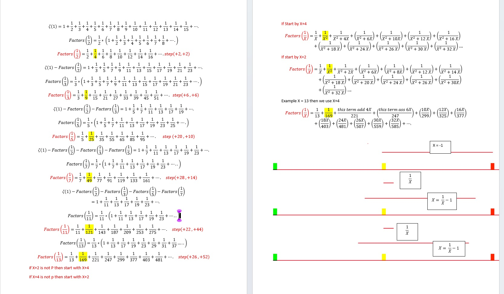
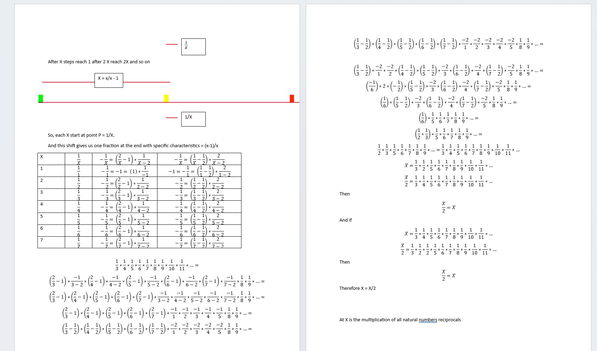
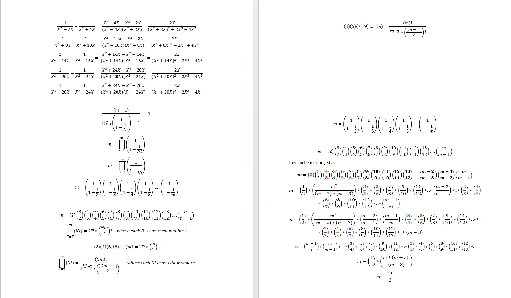
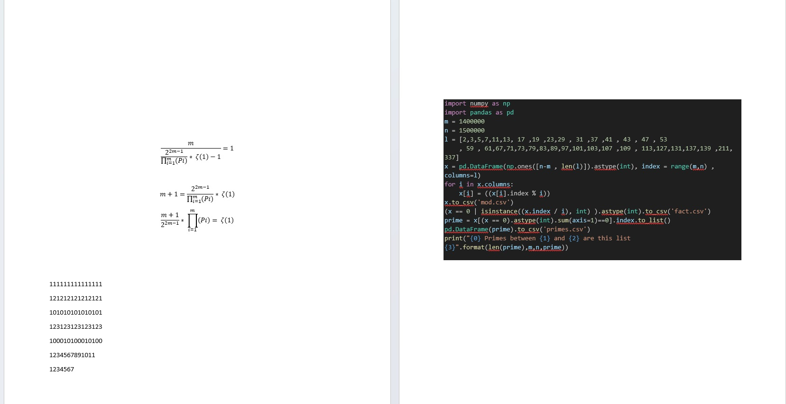

# Rhind Fractions and Zeta Function 
Rhind Fractions And Zeta function
* each fraction in Zeta function is a group of fractions starts from this fraction start point 
and continue until infinity 
* each fraction group we get if by factor out (1/x)
* if we subtract this group of fractions we will have the next consecuance group of fractions 

